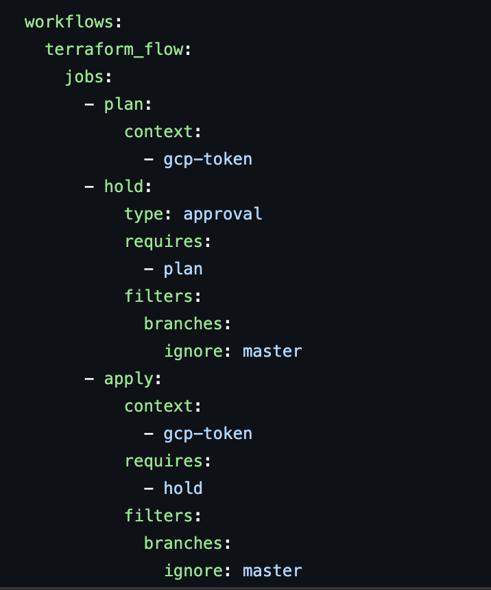

# Deploying a Three-Tier Web Application on GKE

This architecture provides a three-tier solution for deploying Wordpress application that scales independently and utilizes Google's managed services.

## Architecture breakdown

* Frontend: WordPress deployed on GKE
* Middle-tier Backend Service: Node.js API for handling business logic like user profile management, product availability, or custom interactions between the frontend (WordPress) and Cloud SQL.
* Database: Cloud SQL instance using a Cloud SQL proxy sidecar for secure communication between the backend services and the database

## Infrastructure deployment using Terraform

* Regional Private GKE cluster to run the services
* Cloud SQL instance with MySQL for WordPress
* IAM roles and service accounts to follow security best practices 
* VPC Network for network isolation
* Identity-Aware Proxy (IAP) to secure access to applications
* Cloud Armor to provide DDoS protection 

## CI/CD implementation

* Circle Ci workflow running jobs like terraform fmt, terraform plan and terraform apply to automatically deploy infrastructure using terraform ensuring code consistency and validation. 

## Application deployment using declarative manifest files

* Wordpress Deployment object that deploys a demo Wordpress application container with the SQL Proxy agent as a sidecar container  and Service object that exposes the WordPress application externally
* The cloudsql-proxy sidecar container is configured to point to the Cloud SQL instance
* The database username and password are passed to the Wordpress container as environment variables using Kubernetes Secrets, and Workload Identity is configured
* Nodejs API Deployment object that connects between Wordpress and CLoud SQL and Service object as ClusterIP to expose the application withing the Cluster 

## Security hardening

* Network Policies to restrict network traffic between pods
* Secret Management to securly store sensitive information
* Following Least Privilage when assigning IAM roles 

## Other Considerations

* Configure Cloud Monitoring to monitor cluster health, CPU/memory usage, and application metrics
* Enable Cloud Logging to capture application and system logs from GKE
* Configure Readiness and Liveness Probes to ensure WordPress is ready to serve traffic before it’s exposed
* Multi-region deployments to enhance the current setup further
* Use Hub and Spoke Network topology providing more robust network segmentation and isolation

